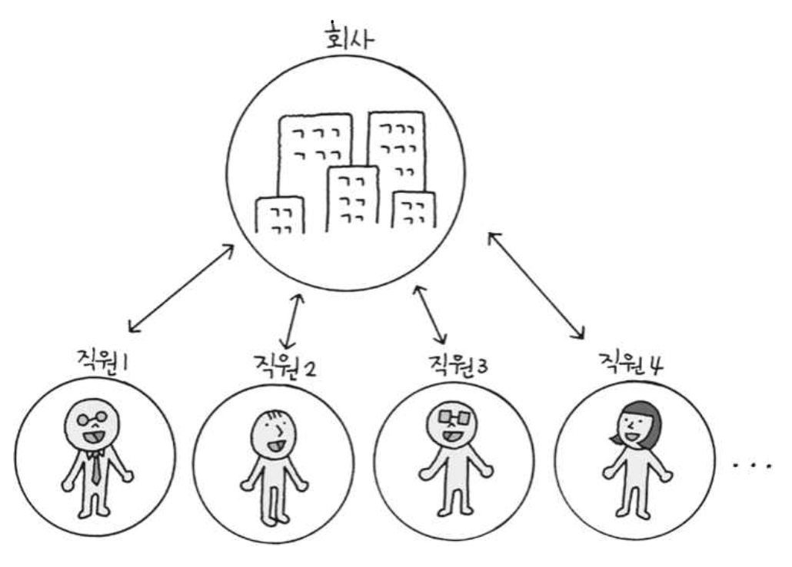

# 싱글톤 패턴

## 싱글톤 패턴이란?

인스턴스를 단 하나만 생성하는 디자인 패턴

## 예시



직원 인스턴스는 여러 개를 생성하는 것이 당연하지만, 회사 객체는 하나만 생성해야 한다.

## 구현하기

### 생성자를 private 으로 만들기

```java
package singleton;

public class Company {
    private Company() { }
}
```

### 클래스 내부에 static으로 유일한 인스턴스 생성하기

```java
package singleton;

public class Company {
    private Company() { }
    private static Company instance = new Company();
}
```

### 외부에서 참조할 수 있는 public 메서드 만들기

```java
package singleton;

public class Company {
    private Company() { }
    private static Company instance = new Company();

    public static Company getInstance() {
        if(instance == null) {
            instance = new Company();
        }
        return instance;
    }
}
```

### 실제로 사용하는 코드 만들기

```java
package singleton;

public class CompanyTest {
    public static void main(String[] args) {
        Company myCompany1 = Company.getInstance();
        Company myCompany2 = Company.getInstance();
        System.out.println(myCompany1 == myCompany2);
    }
}
```

```
true
```
