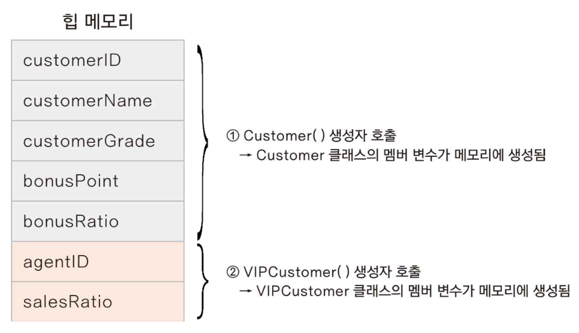
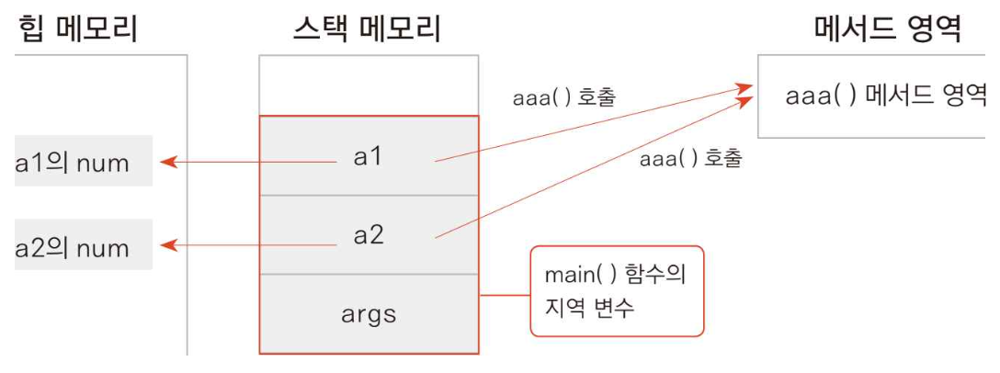
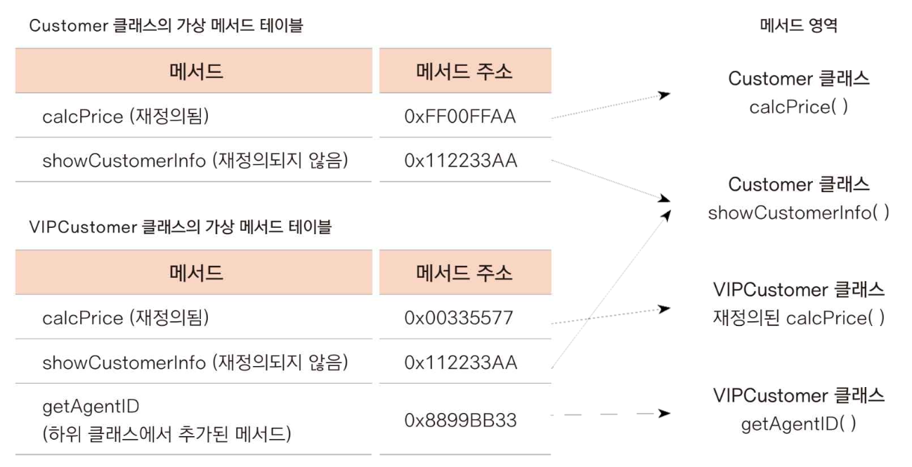

# 상속

## 하위 클래스가 생성되는 과정

```java
package inheritance;

public class Customer {
    protected int customerID;
    protected String customerName;
    protected String customerGrade;
    int bonusPoint;
    double bonusRatio;

    public Customer() {
        customerGrade = "SILVER";
        bonusRatio = 0.01;
        System.out.println("Customer() 생성자 호출");
    }

    public void setCustomerID(int customerID) {
        this.customerID = customerID;
    }

    public int getCustomerID() {
        return customerID;
    }

    public void setCustomerName(String customerName) {
        this.customerName = customerName;
    }

    public String getCustomerName() {
        return customerName;
    }

    public int calcPrice(int price) {
        bonusPoint += price * bonusRatio;
        return price;
    }

    public String showCustomerInfo() {
        return customerName + "님의 등급은 " + customerGrade + "이며, 포인트는 " + bonusPoint + "점입니다.";
    }
}
```

```java
package inheritance;

public class VIPCustomer extends Customer {
    private int agentID;
    double saleRatio;

    public VIPCustomer() {
        customerGrade = "VIP";
        bonusRatio = 0.05;
        saleRatio = 0.1;
        System.out.println("VIPCustomer() 생성자 호출");
    }

    public int getAgentID() {
        return agentID;
    }
}
```

```java
package inheritance;

public class CustomerTest2 {
    public static void main(String[] args) {
        VIPCustomer customerKim = new VIPCustomer();
        customerKim.setCustomerID(10020);
        customerKim.setCustomerName("김유신");
        customerKim.bonusPoint = 10000;
        System.out.println(customerKim.showCustomerInfo());
    }
}
```

```
Customer() 생성자 호출
VIPCustomer() 생성자 호출
김유신님의 등급은 VIP이며, 포인트는 10000점입니다.
```

상위 클래스의 변수가 먼저 메모리에 생성된다.

이는 하위 클래스 생성자에서 `super()`를 자동으로 호출하기 때문이다.

만약, 상위 클래스의 디폴트 생성자인 `Customer()`가 정의되지 않았다면 오류가 발생한다.

### 업캐스팅

```java
Customer vc = new VIPCustomer();
```



클래스가 형 변환이 되었을 때는 선언한 클래스 자료형에 기반하여 멤버 변수와 메서드에 접근할 수 있다.

따라서 `vc` 변수가 가리킬 수 있는 변수와 메서드는 `Customer` 클래스의 멤버 뿐이다.

## 메서드 오버라이딩

### 상위 클래스 메서드 재정의하기

```java
package inheritance;

public class Customer {
    protected int customerID;
    protected String customerName;
    protected String customerGrade;
    int bonusPoint;
    double bonusRatio;

    public Customer() {
        customerGrade = "SILVER";
        bonusRatio = 0.01;
        System.out.println("Customer() 생성자 호출");
    }

    public Customer(int customerID, String customerName) {
        this.customerID = customerID;
        this.customerName = customerName;
    }

    public void setCustomerID(int customerID) {
        this.customerID = customerID;
    }

    public int getCustomerID() {
        return customerID;
    }

    public void setCustomerName(String customerName) {
        this.customerName = customerName;
    }

    public String getCustomerName() {
        return customerName;
    }

    public int calcPrice(int price) {
        bonusPoint += price * bonusRatio;
        return price;
    }

    public String showCustomerInfo() {
        return customerName + "님의 등급은 " + customerGrade + "이며, 포인트는 " + bonusPoint + "점입니다.";
    }
}
```

```java
package inheritance;

public class VIPCustomer extends Customer {
    private int agentID;
    double saleRatio;

    public VIPCustomer() {
        customerGrade = "VIP";
        bonusRatio = 0.05;
        saleRatio = 0.1;
        System.out.println("VIPCustomer() 생성자 호출");
    }

    public VIPCustomer(int customerID, String customerName, int agentID) {
        super(customerID, customerName);
        customerGrade = "VIP";
        bonusRatio = 0.05;
        saleRatio = 0.1;
        this.agentID = agentID;
        System.out.println("VIPCustomer(int customerID, String customerName, int agentID) 생성자 호출");
    }

    public int getAgentID() {
        return agentID;
    }

    @Override
    public int calcPrice(int price) {
        bonusPoint += price * bonusRatio;
        return price - (int) (price * saleRatio);
    }
}
```

```java
package inheritance;

public class OverridingTest1 {
    public static void main(String[] args) {
        Customer customerLee = new Customer(10010, "이순신");
        customerLee.bonusPoint = 1000;

        VIPCustomer customerKim = new VIPCustomer(10020, "김유신", 12345);
        customerKim.bonusPoint = 10000;

        int price = 10000;
        System.out.println(customerLee.getCustomerName() + "님의 지불액: " + customerLee.calcPrice(price));
        System.out.println(customerKim.getCustomerName() + "님의 지불액: " + customerKim.calcPrice(price));
    }
}
```

```
이순신님의 지불액: 10000
김유신님의 지불액: 9000
```

## 가상 메서드

멤버 변수는 인스턴스가 생성될 때마다 새로 생성되지만 메서드는 그렇지 않다.

```java
package virtualfunction;

public class TestA {
    int num;

    void aaa() {
        System.out.println("aaa() 호출");
    }

    public static void main(String[] args) {
        TestA a1 = new TestA();
        a1.aaa();
        TestA a2 = new TestA();
        a2.aaa();
    }
}
```

```
aaa() 호출
aaa() 호출
```



이를 그대로 적용하여 다음과 같이 해석할 수 있다.



```java
package inheritance;

public class OverridingTest3 {
    public static void main(String[] args) {
        Customer customerLee = new Customer(10010, "이순신");
        VIPCustomer customerKim = new VIPCustomer(10020, "김유신", 12345);
        Customer customerNa = new VIPCustomer(10030, "나몰라", 2000);

        int price = 10000;
        System.out.println(customerLee.getCustomerName() + "님의 지불액: " + customerLee.calcPrice(price));
        System.out.println(customerKim.getCustomerName() + "님의 지불액: " + customerKim.calcPrice(price));
        System.out.println(customerNa.getCustomerName() + "님의 지불액: " + customerNa.calcPrice(price));
    }
}
```

```
이순신님의 지불액: 10000
김유신님의 지불액: 9000
나몰라님의 지불액: 9000
```

customerNa의 calcPrice()는 Customer 클래스에 정의된 것이 실행되는 것이 맞지만, 가상 메서드 방식에 의해 VIPCustomer 클래스에서 재정의된 메서드가 호출된다.

## 다운캐스팅과 instanceof

### 다운캐스팅

```java
Animal ani = new Human();
```

인스턴스 ani는 Animal 형이므로 Animal 클래스에서 선언한 메서드와 멤버 변수만 사용할 수 있다.

다시 Human형으로 변환하는 것을 다운캐스팅이라 한다.

### instanceof

hAnimal 인스턴스가 Human() 생성자로 만들어졌다면 Human 형으로 변환하여 human 변수를 만들기

```java
Animal hAnimal = new Human();
if (hAnimal instanceof Human) {
    Human human = (Human) hAnimal;
}
```

```java
package polymorphism;

import java.util.ArrayList;

class Animal {
    public void move() {
        System.out.println("동물이 움직입니다");
    }
}

class Human extends Animal {
    public void move() {
        System.out.println("사람이 걷습니다");
    }

    public void readBook() {
        System.out.println("사람이 책을 읽습니다");
    }
}

class Tiger extends Animal {
    public void move() {
        System.out.println("호랑이가 뜁니다");
    }

    public void hunt() {
        System.out.println("호랑이가 사냥합니다");
    }
}

class Eagle extends Animal {
    public void move() {
        System.out.println("독수리가 납니다");
    }

    public void fly() {
        System.out.println("독수리가 더 높이 납니다");
    }
}

public class AnimalTest {
    ArrayList<Animal> aniList = new ArrayList<Animal>();

    public static void main(String[] args) {
        AnimalTest aTest = new AnimalTest();
        aTest.addAnimal();
        System.out.println("=== 다운캐스팅 ===");
        aTest.testCasting();
    }

    public void addAnimal() {
        aniList.add(new Human());
        aniList.add(new Tiger());
        aniList.add(new Eagle());

        for (Animal ani : aniList) {
            ani.move();
        }
    }

    public void testCasting() {
        for (int i = 0; i < aniList.size(); i++) {
            Animal ani = aniList.get(i);
            if (ani instanceof Human) {
                Human h = (Human) ani;
                h.readBook();
            } else if (ani instanceof Tiger) {
                Tiger t = (Tiger) ani;
                t.hunt();
            } else if (ani instanceof Eagle) {
                Eagle e = (Eagle) ani;
                e.fly();
            } else {
                System.out.println("지원되지 않는 타입입니다");
            }
        }
    }
}
```

```
사람이 걷습니다
호랑이가 뜁니다
독수리가 납니다
=== 다운캐스팅 ===
사람이 책을 읽습니다
호랑이가 사냥합니다
독수리가 더 높이 납니다
```

### 문제

다음 코드에서 오류가 발생하는 원인은?

```java
package inheritance;

public class Employee {
    public String name;
    public String grade;

    public Employee(String name) {
        this.name = name;
    }
}
```

```java
package inheritance;

public class Engineer extends Employee {
    private String skillSet;

    public String getSkillSet() {
        return skillSet;
    }

    public void setSkillSet(String skillSet) {
        this.skillSet = skillSet;
    }
}
```

상위 클래스에서 `Employee()` 생성자가 정의되지 않아 하위 클래스에서 `super()`를 호출할 수 없다.
